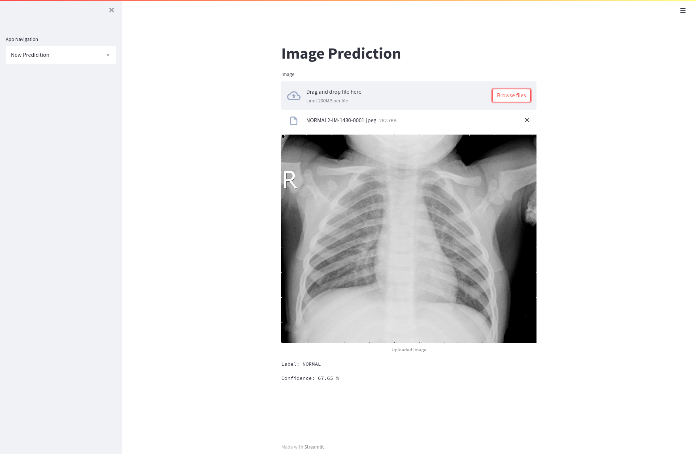

# Chest X-Ray Image Classification

This an introductory problem for image classfication using deep learning techniques such ConvNets. I used the [dataset](https://www.kaggle.com/paultimothymooney/chest-xray-pneumonia) from kaggle.

I used `streamlit` for building the ui, where you can upload in image and get predictions.

## Screenshots

## Requirements
- streamlit
- pandas
- pytorch

## Scripts
- `train.py`: run training
- `process.py`: generate csv metadata
- `download.sh`: download the dataset from kaggle

## Models
- Resnet 18

## TODO:
### Models
- VGG
- Resnet 32
- Densenet
### Integrations:
- wandb
- plot neural network architecture